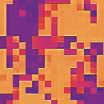
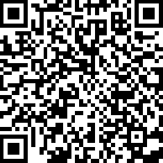

# Aldo-Moro-crowdfunding-token
standard erc20 ethereum token

## About
ALDO MORO crowdfunding token (MORO TOKEN) is cryptocurrency token, launched to support independent investigations about the death of Aldo Moro.
The MORO is ERC20 standard ethereum token.

### MORO TOKEN LOGO 

### CONTRACT ADRESS QR CODE

## Specifications

* ERC20 ethereum standard token
* Contract Address 0xB942CC393b2A934327aF72843CEbE70DbA7E0d4f
* name: ALDO MORO crowdfunding token
* total Supply: 197,805.09
* decimals: 2
* version: H0.1
* symbol: MORO 

## LINKS

1. [Explorer](https://ethplorer.io/address/0xfe0bf738bbe15fef8b76b8c6e7f2b1d6c0d3a50c#pageSize=50)
2. [Crowdsale](https://morotoken.blogspot.com) 
3. [Website](https://morotoken.wordpress.com/)
4. [Twitter](https://twitter.com/MoroToken)
